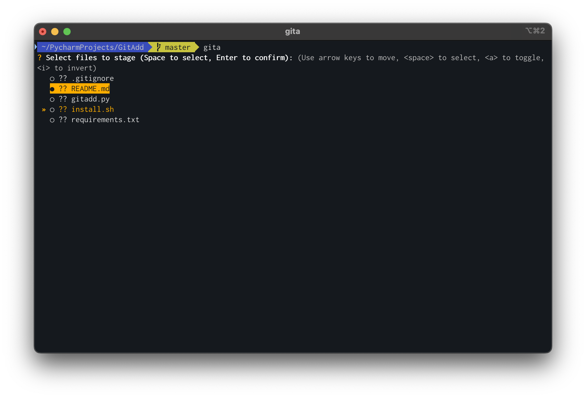

# git-add

A small script that adds a TUI interactiveness to `git add` 

### Installation

Prerequisites: 
 - Linux/MacOS 
 - Python >3.10

Steps:
 - Clone the repo
 - Run `./install.sh INSTALL_DIR` 

Where `INSTALL_DIR` is directory to install the shorthand scripts into (e.g. `~/bin`). 
Note that `INSTALL_DIR` must be in `$PATH` for this to work. 

### Usage

After installing, you'll have 2 brand-new scripts in your `$PATH`: 
 - `gita`: Activates `.venv` and runs `gitadd.py` as-is 
 - `gita`: Activates `.venv` and runs `gitadd.py --commit`, which triggers a `git commit -a` after staging selected changes 

Run either in some git project, select files via arrow keys and space, hit enter when ready.  
If using `gitc` it will prompt for a commit message after selecting files.  
